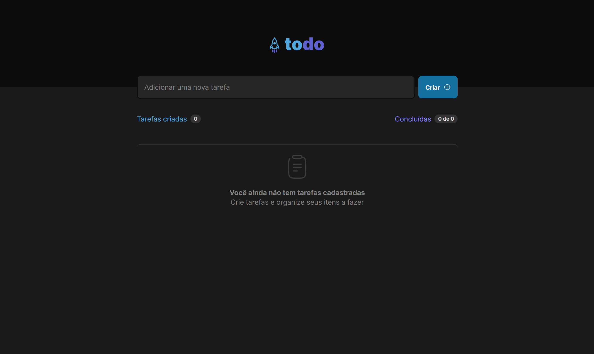

# ToDo List

Esse projeto foi um desafio proposto pelo curso de react da rockeatseat para colocar alguns ensinamentos em prática. 
E criei algumas funcionalidades como criação da tarefa, selecionar a tarefa como checado e deletar a tarefa.

* [Status do Projeto](#status-do-Projeto)
* [Preview](#Preview)
* [Pré-requisito](#Pré-requisito)
* [Como rodar a aplicação](#Como-rodar-a-aplicação)
* [Construido com](#Construido-com)
* [Autor](#Autor)

## Status do Projeto


## Preview




## Pré-requisito

- Git instalado na máquina
- Npm instalado na máquina
- Node instalado na máquina na versão 22.11.0

## Como rodar a aplicação

No terminal, clone o projeto:

```
git clone https://github.com/luizamaro11/landing-page-onm.git
```

Instale as dependências

```
npm install
```

Inicialize o projeto

```
npm run dev
```

## Construido com

- Marcação semântica HTML5
- Flexbox
- CSS Grid
- CSS responsivo
- typescript
- react
- vite

## Autor

[<br><sub>Luiz Henrique</sub>](https://github.com/luizamaro11)